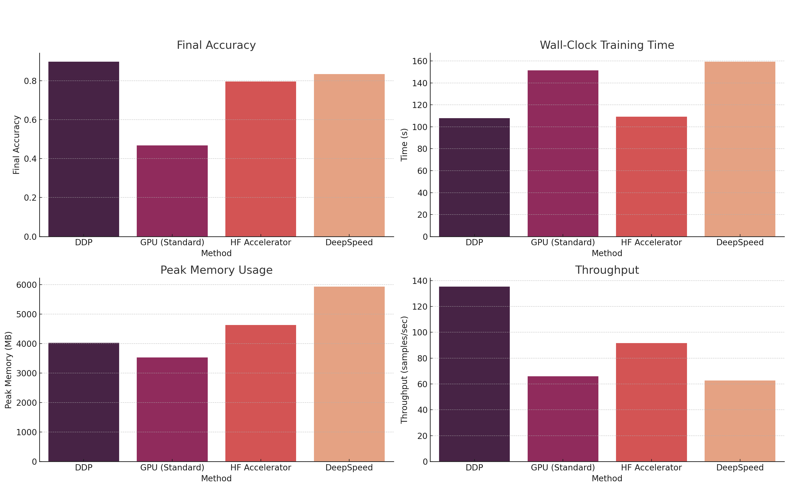
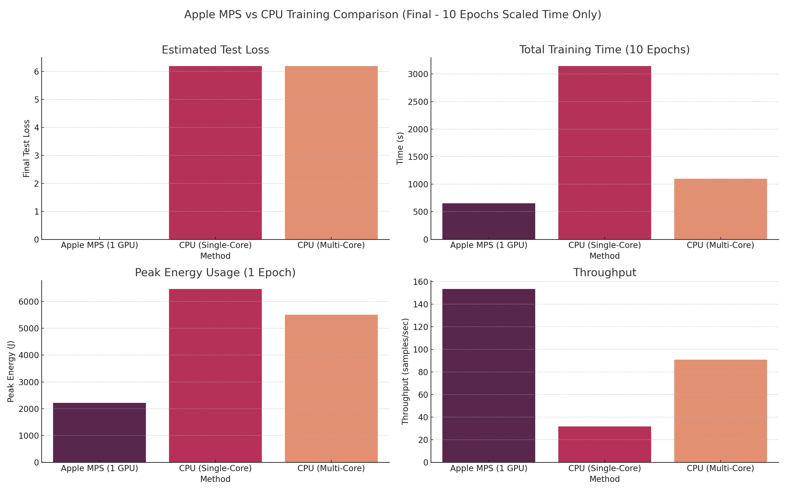

## Overview

This project's aim is to implement a simple chatbot using sequence to sequence approach and perform different methods for training the model data. For the hardwares, i have used 2x Nvidia RTX 4090 to utilize multiple GPU Parallelization. I have compared Standard GPU Deepspeed acceleration from Microsoft, Accelerator from Huggingface, Pytorch DDP, and finally, training on GPU using pytorch. The goal of this project is to see which one of these techniques work better for relatively small dataset like this and possibly for a bigger LLM as well. Therefore, GPU oriented parts will require multiple GPUs to run.
## Setup

It is also recommended to download the final.zip file in order to run on own directory. 

When using github repository. Clone the Repository and Navigate

```
git clone https://github.com/bat-amgalan09/605final.git
cd 605final
```

Create a conda environment with python 3.10

```bash
conda create -n mvenv python=3.10
conda activate mvenv
```

Install requirements (Training data will be downloaded automatically)

```bash
python3 -m pip install -r requirements.txt
```

## Usage

Call_func folder has all the main functions to call each training session. 
All GPT-2 based chatbots are using the same [DailyDialog](https://huggingface.co/datasets/daily_dialog) dataset. For Example:

```bash
python main_ddp.py
python main.py
accelerate launch —-num_processes=2 main_accelerator.py
python deepspeed_train.py
python main_gpu.py
```
All the parameters are in train functions excepts for deepspeed test where params are in ds_config.json

Each run will give different training session with same epochs and batch size. Which then can be used to compare. With the model from DDP, there is an interactive chatbot function which can be called using.

```bash
python chat_ddp_interactive.py
```

## Project Structure

```bash
605final/
├── Call_func/               # Main_****.py functions to start training sessions
├── Chatbot_model/            # Data loading and chatbot
├── cpu_train/                # Cpu oriented
├── GPU_trainning/             # GPU oriented
├── plots/             # Pictures and plots from comparisons
├── requirements.txt  
└── README.md
```
## Python, hardware dependency

Cpu, standard gpu processes doesn't require specific versions. But multi GPU utilization will require the system to use CUDA 12+ with correct driver to be used. As for ALPA, it is confusing to find right versions due to its dependency on JAXlib.

## Docker support

Build docker image or use the prebuilt one with main func as main_gpu

```bash
docker build -t dockerhubusername/chatbot_try
docker pull amgalan09/chatbot_try
docker run --rm amgalan09/chatbot_try
```

## Result 

Use visuals function to visualize the given test results





Video Demonstration of training DDP version with 2x GPU and live interactive chatbot function is can be found:

[https://drive.google.com/file/d/19HWdjZ54Z0cLXvUM8RbksWGTDKibhu9S/view?usp=sharing][https://drive.google.com/file/d/19HWdjZ54Z0cLXvUM8RbksWGTDKibhu9S/view?usp=sharing]
